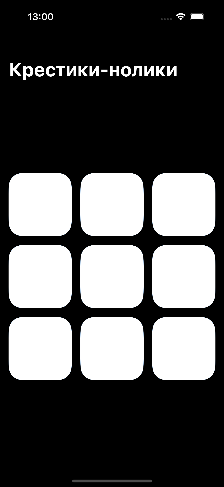
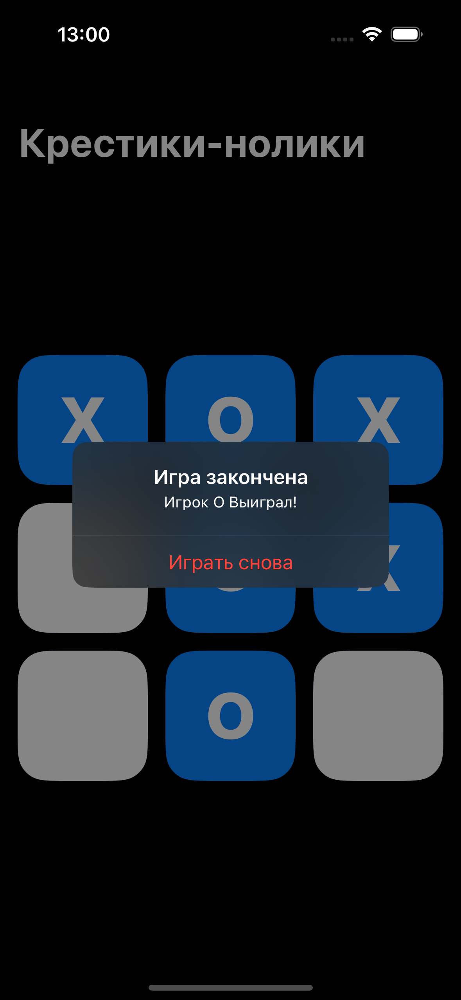
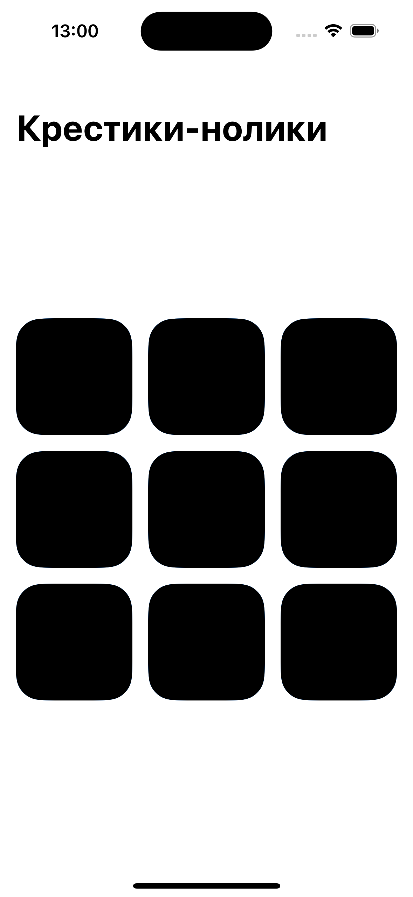
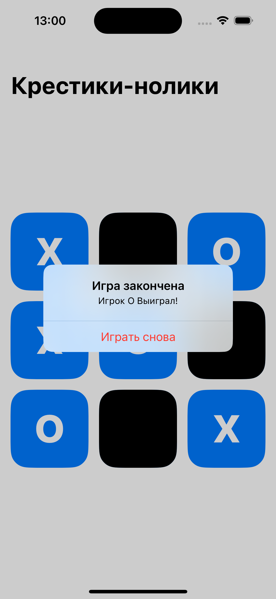

# SwiftUI Tic-Tac-Toe

Простая, но элегантная игра «Крестики-нолики», полностью созданная на SwiftUI для iOS. Этот проект демонстрирует использование современных практик SwiftUI, архитектуры MVVM и динамическую обработку тем и макетов пользовательского интерфейса.

## Game Themes

### Dark Theme
    

### Light Theme
    

## Функции

- **SwiftUI Интерфейс**: Полностью созданный на SwiftUI, демонстрирующий, как программно создавать интерфейсы с помощью новейшей платформы пользовательского интерфейса Apple.
- **Поддержка темного режима**: Плавно переключайтесь между светлыми и темными темами, улучшая взаимодействие с пользователем в различных средах.
- **MVVM Architecture**: Использует архитектуру Model-View-ViewModel (MVVM) для отделения бизнес-логики от кода пользовательского интерфейса, что делает базу кода более удобной для сопровождения и тестирования.
- **Dynamic Layout**: Адаптируется к различным размерам и ориентациям экрана, обеспечивая единообразное взаимодействие с пользователем на всех устройствах.

